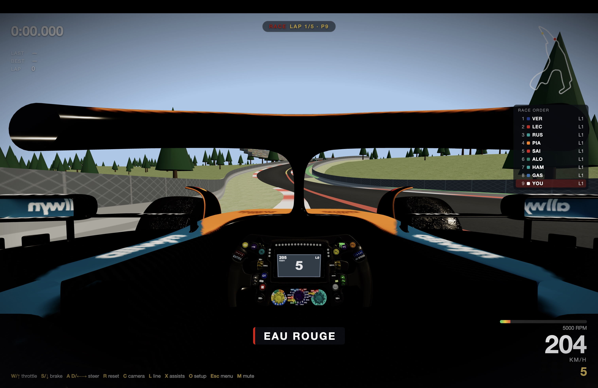
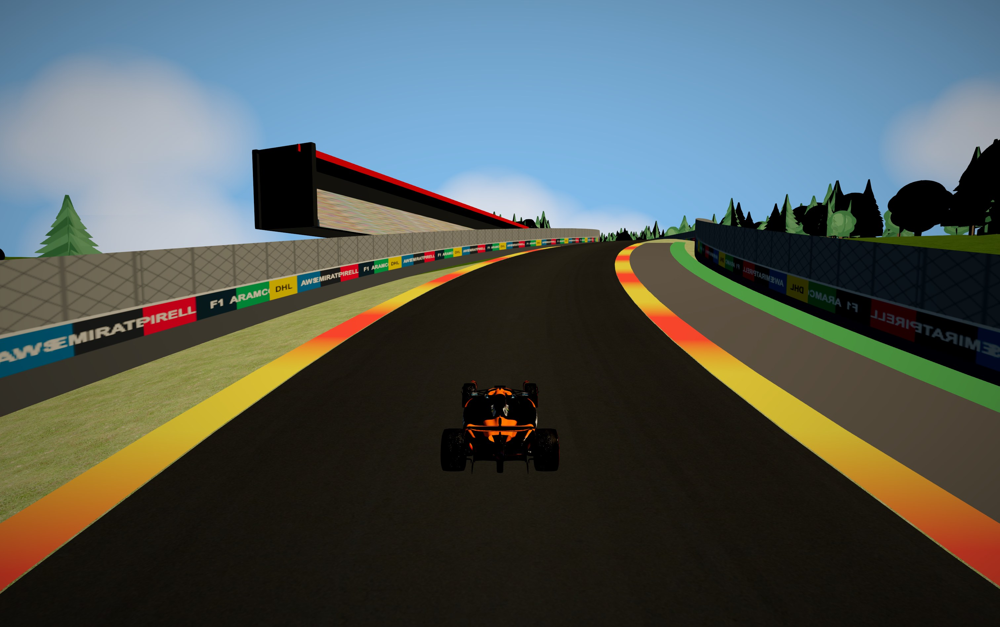

# Ardennes GP

**A browser racing game on the real Circuit de Spa-Francorchamps** — built with
Three.js, an original 120 Hz physics model, and open geodata. Qualify against a
field of rivals, then race them over the real Ardennes layout with true LiDAR
elevation. Runs in any modern browser, no install.



<p align="center"><em>Cockpit race view at Eau Rouge — live wheel, LCD, and race order</em></p>



<p align="center"><em>Chasing the pack down the Kemmel straight</em></p>

> All code and built-in art are original. Not affiliated with and containing no
> assets from Formula 1, F1 25, EA, or Codemasters. Drop-in slots let you play
> with your own car, wheel, textures, and engine sound — see
> [Bring your own assets](#bring-your-own-assets).

## Quick start

```bash
npm install
npm run dev        # open the printed localhost URL
```

Pick a mode from the start menu and go.

## Modes

Chosen from the start menu:

- **Quick Race** — straight to a standing-start race against eight rivals over
  3, 5, or 10 laps. You start at the back; carve your way forward.
- **Quali + Race** — a qualifying session (3, 5, or 8 minutes, your pick) sets
  your grid slot against the field, then rolls straight into the race.
- **Practice** — free running, no clock, just you and the circuit.

A live timing tower ranks the field; in the race it tracks position and laps,
in qualifying it shows the lap-time order. Finish a race and you're classified
on the results screen.

## Controls

| Key | Action |
|-----|--------|
| W / ↑ | Throttle |
| S / ↓ | Brake |
| A, D / ← → | Steer |
| C | Camera: chase → cockpit → nose |
| L | Racing line on/off |
| X | Assists (auto-brake + traction) on/off |
| O | Cockpit setup panel (wheel & seat sliders) |
| R | Reset to track |
| Esc | Back to menu |
| M | Mute |

## Track accuracy

- **Layout** — real centerline stitched from the OpenStreetMap circuit relation
  (31 raceway segments: Eau Rouge, Raidillon, Kemmel, Pouhon, Blanchimont, …).
  Measured 6,995 m vs the real 7,004 m (~0.1% error). Map data ©
  OpenStreetMap contributors, ODbL.
- **Elevation** — true heights sampled per track point from the Walloon
  Region's open 50 cm LiDAR terrain model (MNT 2021–2022): 102 m of real
  elevation change, including the Eau Rouge compression and the 41 m Raidillon
  climb.
- **Corner names** — from the OSM segment names, shown live as you drive.

The processed track ships in `src/track.json`, so no network access or data
rebuild is needed to play.

## Physics

Original single-track (bicycle) model at 120 Hz: slip-angle tire forces with a
friction circle, aero downforce and drag, brake/throttle load transfer, a
7-speed gearbox. Assists (on by default) manage braking points and traction so
anyone can lap; turn them off with **X** for the full challenge.

## Cockpit setup

Press **O** for a live setup panel that saves to your browser:

- **Wheel** — move the steering wheel in X / Y / Z to fit the car
- **Driver** — seat fore/aft, eye height, view pitch, and field of view

## Bring your own assets

The game is complete with its built-in low-poly car, procedural wheel, tarmac,
and synthesized V6 engine. Drop any of these into `public/` to upgrade — each
is optional and auto-detected:

| File | What it does |
|------|--------------|
| `public/car.glb` | Replaces the car (~5.6 m, +Z forward). Name wheel meshes `FL_Wheel`, `FR_Wheel`, `RL_Wheel`, `RR_Wheel` for spin + steering; optional `FL_Cover`/`FR_Cover` aero covers steer without spinning. The model is auto-leveled to the track from its wheel centers. |
| `public/wheel.glb` | Replaces the cockpit steering wheel; the live LCD composites onto its screen. |
| `public/textures/road.png` | Tiling asphalt for the track. |
| `public/textures/grass.png` | Tiling grass for shoulders and terrain. |
| `public/engine.wav` | Looping engine recording, pitch-shifted with the revs. |

**Check each asset's license yourself** — most model licenses allow personal
use but not redistribution, which is why none are bundled here.

## License

Code: MIT (see `LICENSE`). Track geometry derives from OpenStreetMap (©
OpenStreetMap contributors, ODbL) and Service public de Wallonie open geodata.
